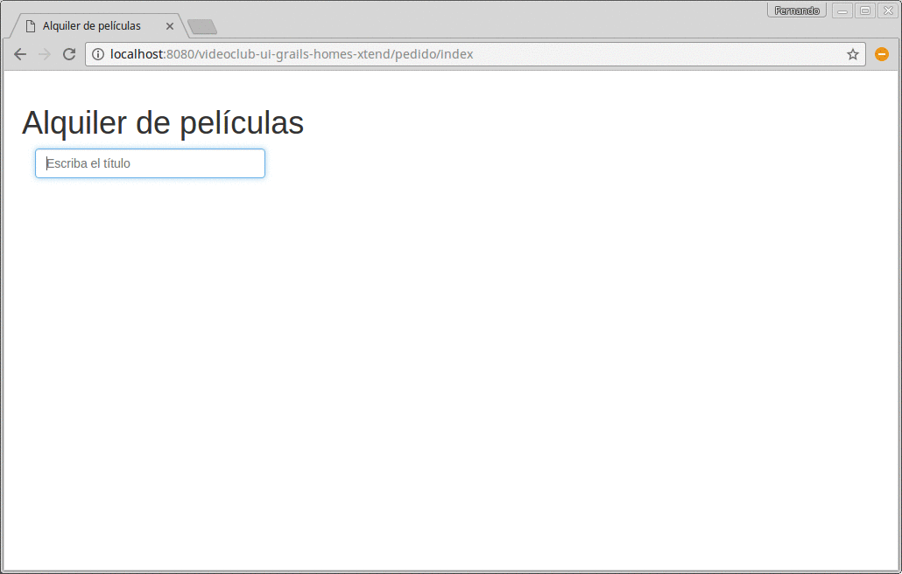

# Videoclub en Grails

## Explicación

Pantalla para alquilar películas que se divide en varias partes, de manera que el cliente pueda disparar pedidos asincrónicos (vía AJAX | jQuery-UI). 

**Ventajas:** se puede filtrar las películas a medida que se va completando el campo, sin necesidad de traer todas las películas al cliente. No se refresca toda la página cuando se busca una película, se selecciona o bien cuando se agrega o elimina una película al pedido.

## Consideraciones

* [Instalar el plugin de Xtend](http://uqbar-wiki.org/index.php?title=Integraci%C3%B3n_Grails_con_Xtend)
* El objeto de dominio está en Xtend
* También el repositorio (objeto de acceso a datos)
* Los controllers y las vistas son propias de Grails

## Versión del proyecto de Grails

* Grails 2.4.2
* en un entorno GGTS 3.6.0
* con Twitter Boostrap 3.2.0
* y Xtend 2.7.3
